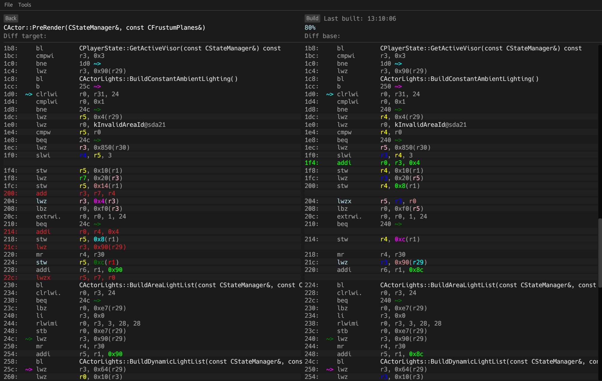

# objdiff [![Build Status]][actions]

[Build Status]: https://github.com/encounter/objdiff/actions/workflows/build.yaml/badge.svg
[actions]: https://github.com/encounter/objdiff/actions

A local diffing tool for decompilation projects. Inspired by [decomp.me](https://decomp.me) and [asm-differ](https://github.com/simonlindholm/asm-differ).

Features:

- Compare entire object files: functions and data.
- Built-in symbol demangling for C++. (CodeWarrior, Itanium & MSVC)
- Automatic rebuild on source file changes.
- Project integration via [configuration file](#configuration).
- Search and filter all of a project's objects and quickly switch.
- Click to highlight all instances of values and registers.

Supports:

- PowerPC 750CL (GameCube, Wii)
- MIPS (N64, PS1, PS2, PSP)
- x86 (COFF only at the moment)
- ARM (GBA, DS, 3DS)
- ARM64 (Switch, experimental)

See [Usage](#usage) for more information.

## Downloads

To build from source, see [Building](#building).

### GUI

- [Windows (x86_64)](https://github.com/encounter/objdiff/releases/latest/download/objdiff-windows-x86_64.exe)
- [Linux (x86_64)](https://github.com/encounter/objdiff/releases/latest/download/objdiff-linux-x86_64)
- [macOS (arm64)](https://github.com/encounter/objdiff/releases/latest/download/objdiff-macos-arm64)
- [macOS (x86_64)](https://github.com/encounter/objdiff/releases/latest/download/objdiff-macos-x86_64)

For Linux and macOS, run `chmod +x objdiff-*` to make the binary executable.

### CLI

CLI binaries can be found on the [releases page](https://github.com/encounter/objdiff/releases).

## Screenshots




## Usage

objdiff works by comparing two relocatable object files (`.o`). The objects are expected to have the same relative path
from the "target" and "base" directories.

For example, if the target ("expected") object is located at `build/asm/MetroTRK/mslsupp.o` and the base ("actual")
object is located at `build/src/MetroTRK/mslsupp.o`, the following configuration would be used:

- Target build directory: `build/asm`
- Base build directory: `build/src`
- Object: `MetroTRK/mslsupp.o`

objdiff will then execute the build system from the project directory to build both objects:

```sh
$ make build/asm/MetroTRK/mslsupp.o # Only if "Build target object" is enabled
$ make build/src/MetroTRK/mslsupp.o
```

The objects will then be compared and the results will be displayed in the UI.

See [Configuration](#configuration) for more information.

## Configuration

While **not required** (most settings can be specified in the UI), projects can add an `objdiff.json` file to configure the tool automatically. The configuration file must be located in
the root project directory.

If your project has a generator script (e.g. `configure.py`), it's recommended to generate the objdiff configuration
file as well. You can then add `objdiff.json` to your `.gitignore` to prevent it from being committed.

```json
{
  "$schema": "https://raw.githubusercontent.com/encounter/objdiff/main/config.schema.json",
  "custom_make": "ninja",
  "custom_args": [
    "-d",
    "keeprsp"
  ],
  "build_target": false,
  "build_base": true,
  "watch_patterns": [
    "*.c",
    "*.cp",
    "*.cpp",
    "*.cxx",
    "*.h",
    "*.hp",
    "*.hpp",
    "*.hxx",
    "*.s",
    "*.S",
    "*.asm",
    "*.inc",
    "*.py",
    "*.yml",
    "*.txt",
    "*.json"
  ],
  "units": [
    {
      "name": "main/MetroTRK/mslsupp",
      "target_path": "build/asm/MetroTRK/mslsupp.o",
      "base_path": "build/src/MetroTRK/mslsupp.o",
      "metadata": {}
    }
  ]
}
```

### Schema

View [config.schema.json](config.schema.json) for all available options. The below list is a summary of the most important options.

`custom_make` _(optional)_: By default, objdiff will use `make` to build the project.  
If the project uses a different build system (e.g. `ninja`), specify it here.  
The build command will be `[custom_make] [custom_args] path/to/object.o`.

`custom_args` _(optional)_: Additional arguments to pass to the build command prior to the object path.

`build_target`: If true, objdiff will tell the build system to build the target objects before diffing (e.g.
  `make path/to/target.o`).  
This is useful if the target objects are not built by default or can change based on project configuration or edits
to assembly files.  
Requires the build system to be configured properly.

`build_base`: If true, objdiff will tell the build system to build the base objects before diffing (e.g. `make path/to/base.o`).  
It's unlikely you'll want to disable this, unless you're using an external tool to rebuild the base object on source file changes.

`watch_patterns` _(optional)_: A list of glob patterns to watch for changes.
([Supported syntax](https://docs.rs/globset/latest/globset/#syntax))  
If any of these files change, objdiff will automatically rebuild the objects and re-compare them.  
If not specified, objdiff will use the default patterns listed above.

`units` _(optional)_: If specified, objdiff will display a list of objects in the sidebar for easy navigation.

> `name` _(optional)_: The name of the object in the UI. If not specified, the object's `path` will be used.
> 
> `target_path`: Path to the "target" or "expected" object from the project root.  
> This object is the **intended result** of the match.
> 
> `base_path`: Path to the "base" or "actual" object from the project root.  
> This object is built from the **current source code**.
> 
> `metadata.auto_generated` _(optional)_: Hides the object from the object list, but still includes it in reports.
> 
> `metadata.complete` _(optional)_: Marks the object as "complete" (or "linked") in the object list.  
> This is useful for marking objects that are fully decompiled. A value of `false` will mark the object as "incomplete".

## Building

Install Rust via [rustup](https://rustup.rs).

```shell
$ git clone https://github.com/encounter/objdiff.git
$ cd objdiff
$ cargo run --release
```

Or using `cargo install`.

```shell
$ cargo install --locked --git https://github.com/encounter/objdiff.git objdiff-gui objdiff-cli
```

The binaries will be installed to `~/.cargo/bin` as `objdiff` and `objdiff-cli`.

## License

Licensed under either of

- Apache License, Version 2.0, ([LICENSE-APACHE](LICENSE-APACHE) or <http://www.apache.org/licenses/LICENSE-2.0>)
- MIT license ([LICENSE-MIT](LICENSE-MIT) or <http://opensource.org/licenses/MIT>)

at your option.

### Contribution

Unless you explicitly state otherwise, any contribution intentionally submitted for inclusion in the work by you, as
defined in the Apache-2.0 license, shall be dual licensed as above, without any additional terms or conditions.
